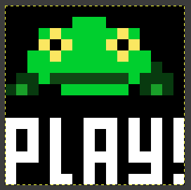
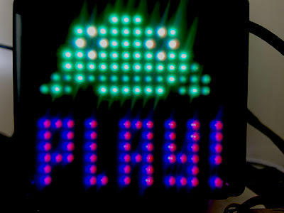
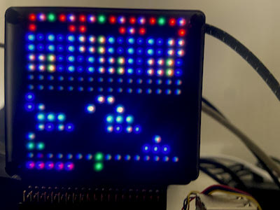
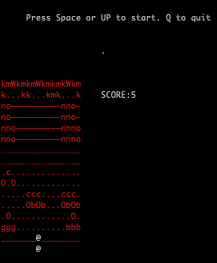
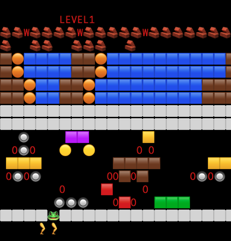

# Unicorn Hat HD Frogger 
By MarkW


I loved frogger, I still play it sometimes. 

I watched an excellent way to build it here
[Code-It-Yourself! Frogger - Programming from Scratch (Quick and Simple C++)](https://www.youtube.com/watch?v=QJnZ5QmpXOE)
so big thanks to JavidX9 for the great solution. I was indeed thinking of going OOP with it all for that. To see that kind of path, watch codingtrain have a go, and then refactor 
still not as elegantly as Javids solution I reckon. And exactly where I see myself having gone without his tip about using lanes instead. 

The game shows the representation of the inner workings in the console in curses when you run it. You could just play it on that I suppose. Console frogger? 

It gets faster each time you get a frog home, so it gets impossible very quickly. You could change that by messing with the values in speedmap in game.py. 
You need to get in the middle of the exit or you'll die, don't be fooled, aim for the green dots at the top. 


## Pimoroni Unicorn Hat HD Frogger Game. 

Use the LEFT and RIGHT Arrow keys, UP or SPACEBAR is forwarwd. 
Q to quit. 


## Install Instructions 
You'll need PIL and it's an outdated version too. I'll try to fix that but it's not my dependency 
it's in the unicorn hat driver/handler somewhere. 

```shell
python -m venv venv
source venv/bin/activate
```

```shell
pip install Pillow==9.5.0
```

## How to run it? 
```shell
python ./frogger.py 
```

## What if it's sideways?
Pass the rotation in to the script, this will flip it 180 degrees
```shell
python ./frogger.py 180
```
Or this will make it sideways 
```shell
python ./frogger.py -90
```



## Frogger in action demo video 
[YouTube video of Frogger in action on a Unicorn HD 16x16 Hat, on Pi5 with NVME base and a HAT hacker Hat, all from Pimoroni ](https://youtu.be/FM_PzdKImLo)

-- I'm Commander Shepard and this is the best frogger on the citadel.



I know what you're thinking, Emoji Frogger. I tried replacing all the characters with emojis, it made a wonderful version with very fancy graphics.
Enable it in the definitions.py



